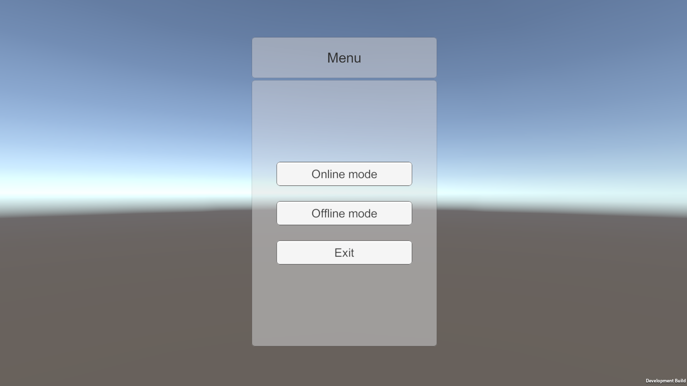
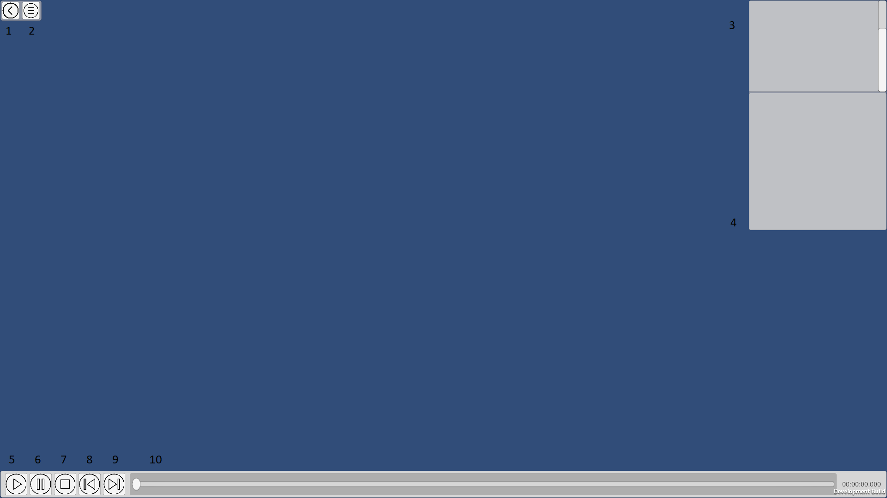
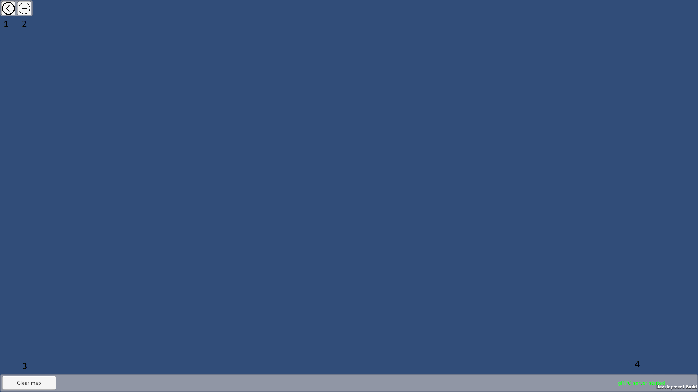
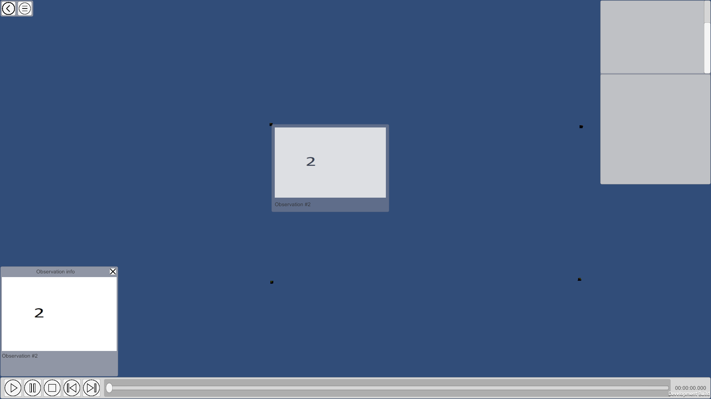

### Работа с Elektronik Tools 2.0 начинается с главного меню

В главном меню Вы можете выбрать один из режимов взаимодействия с Электроником.
1. [Онлайн режим](#Онлайн) - данные передаются по TCP соединению.
2. [Оффлайн режим](#Оффлайн) - данные считываются из файла.

Ознакомиться с форматом входных данных Вы сможете на [этой странице](Data-RU.md).

# Оффлайн

Если Вы выбрали оффлайн режим, то перед Вами откроется его окно настроек.

В этом окне Вы можете выбрать файл, который хотите воспроизвести, 
а также указать директорию в которой были сохранены изображения с камеры полученные записи (не обязательно), 
и коэффициент масштабирования, который будет применяться к считываемым данным.

После того, как вы выберете файл, необходимо нажать на кнопку Load. 
Если кнопка Load не доступна для нажатия, значит файл не был найден, и необходимо проверить правильность пути до него.

После успешной загрузки файла, Вы увидите следующее окно.

Если файл достаточно большой, то необходимо подождать пока он обработается.

На картинке выше обозначены следующие элементы управления и отображения информации:

1. Вернуться к выбору файла
2. [Общие настройки](#Настройки)
3. Окно отображения информации о событии.
4. В данной области будут перечислены объекты со "специальной" информацией. 
    Перечисления будут представлены в виде кнопок, по нажатию на которые камера переместится к объекту, 
    а в верхней центральной части экрана появится информация об этом объекте.
5. Начать проигрывание событий записанных в файле. Для того, чтобы быстро отмотать вперёд используйте ползунок (см. п. 10)
6. Приостановить проигрывание.
7. Остановить проигрывание. Останавливает проигрывание и очищает сцену. Можно также использовать просто для очистки сцены.
8. Промотать до предыдущего ключевого события. (Клавиша '[')
9. Промотать до следующего ключевого события. (Клавиша ']')
10. Ползунок перемотки событий. С помощью данного ползунка Вы сможете перематывать события. 
    Во время перемотки информация не отрисовывается для каждого из перематываемых событий. 
    Перерисовка происходит только на событии, к которому необходимо перемотать. 

# Онлайн

Если Вы выбрали онлайн режим, то перед Вами откроется следующее окно настроек.

В качестве настроек выступают:

1. IP адрес TCP сервера, с которого будут приниматься данные.
2. Порт TCP сервер, с которого будут приниматься данные.
3. Коэффициент масштабирования входных данных.

После того, как все необходимые настройки были установлены, необходимо нажать на кнопку Load.
Если кнопка не нажимается, проверьте правильность IP-адреса и порта. Заметьте, что соединение 
не устанавливается сразу по нажатию кнопки Load, поэтому Вы можете загрузить сцену, даже если серверная часть ещё не работает.

После того, как все настройки были установлены Вы перейдёте на следующую сцену.

1. Вернуться к выбору файла.
2. [Общие настройки](#Настройки).
3. Очистка сцены. Не применяйте её во время приёма данных! 
   Обновление карты происходит в инкрементном стиле, поэтому преждевременная очистка приведёт к ошибке.
4. Статус подключения.

# Настройки

Общие настройки для обоих режимов.

1. Включить / выключить отображение облака точек. Добавление точек в облако при этом не отключается.
2. Ползунок изменения размера точек
3. Включить / выключить отображение треков.
4. Включить / выключить отображение наблюдений.
5. Включить / выключить отображение плоскостей.
6. Включить / выключить отображение изображения с камеры.
7. Сменить тип камеры (пока доступен только один: свободная камера).
8. Переключение в VR режим (см. [VR режим](#VR-режим)).

# Наблюдения

Elektronik позволяет увидеть дополнительную информацию о наблюдении, при наведении курсора мыши с помощью высплывающего окна.
При клике по наблюению, данное окно будет закреплено слева-снизу.
Узнать как, передать долнительную информацию можно [здесь](Data-RU.md#Наблюдения).
Отображение текстовой информации работает в обоих режимах, тогда как изображения только в оффлайн, 
и если была указана директория в которой они хранятся.

# Изображения с камеры

При включенной [настройке](Настройки) "Camera view", в правом нижнем углу будет закреплено окно,
в котором будут отображаться изображения с камеры.
Узнать как, передать изображения можно [здесь](Data-RU.md#Пакеты%20с%20изображением).
Данная функция работает в обоих режимах, но для оффлайн необходимо указать директорию в которой сохранены изображения.

# VR-режим

Этот режим сработает, только если у Вас подключен VR шлем и он поддерживается Unity 
(например, если он поддерживается в SteamVR). В VR режиме Вы будете видеть сцену из VR шлема и наблюдать процесс построения карты.

В данном режиме Вы можете привязаться либо к позиции подключенного шлема, либо подменить эту позицию координатами, 
которые генерируются Вашим алгоритмом. Настроить поведение Вы сможете в "VR Settings" из 
[онлайн режима](#Онлайн) или [оффлайн режима](#Оффлайн).

[<- Стартовая страница](Home-RU.md) | [Формат обмена данными ->](Data-RU.md)